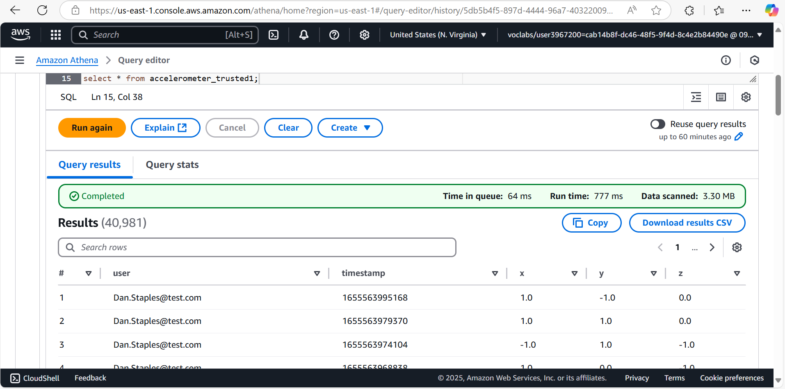
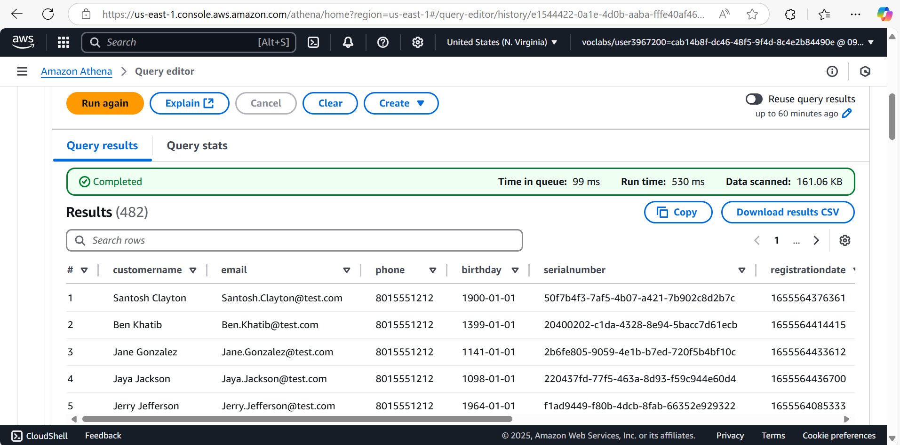

# STEDI Human Balance Analytics – Data Lakehouse Project

## 🧠 Project Overview

This project was developed as part of the STEDI Step Trainer initiative to build a data lakehouse solution capable of supporting machine learning for human balance analysis. The system processes sensor data from step trainers and mobile accelerometers to curate high-quality datasets for training a step-detection model.

## 📌 Objective

Design a scalable, cloud-based data architecture using AWS services to:
- Ingest sensor and customer data
- Transform and cleanse the data using AWS Glue (PySpark)
- Curate and join datasets in a privacy-compliant manner
- Enable machine learning workflows for real-time step detection

---

## 🛠️ Tech Stack

- **AWS Glue** – ETL orchestration
- **Apache Spark (PySpark)** – Distributed data processing
- **Amazon S3** – Data lake storage
- **Amazon Athena** – Querying curated datasets
- **Snowflake** – Analytical data warehousing
- **SQL** – DDL for table creation
- **Python** – ETL scripting

## 📌 Folder Structure
```
📂 STEDI Human Balance Analytics
│── 📂 DDL              # SQL Commands
│── 📂 Python_scripts   # All the spark Jobs
│── 📂 screenshots      # Output screenshots
│── README.md           # Project Documentation
```

## 🔄 ETL Pipeline Overview

1. **Landing Zone Setup (DDL):**
   - Create tables for `accelerometer`, `customer`, and `step_trainer` raw data.

2. **Trusted Zone Transformation:**
   - `accelerometer_landing_to_trusted1.py`
   - `customer_landing_to_trusted.py`
   - `step_trainer_landing_to_trusted.py`

3. **Curated Zone Creation:**
   - Join customer-trusted data with sensor data using `customer_trusted_to_curated.py`.

4. **Final Curation for ML:**
   - Combine accelerometer and step trainer data using `machine_learning_curated.py` for training the step detection model.

---

## 📊 Results

- Successfully transformed and curated multi-source sensor and customer data
- Final dataset is structured and stored in S3 in a machine learning-ready format
- The architecture supports efficient querying using Athena and can scale for real-time ingestion

---

## 🧠 Learnings

- Implemented Spark-based ETL pipelines using AWS Glue
- Hands-on experience with AWS cloud data engineering tools
- Built foundational architecture for ML model training on human motion data

---

## 📷 Sample Outputs

<p float="left">
  
  
</p>

---
## 🤝 Authors
- **Sangamesh V U** - [LinkedIn](https://www.linkedin.com/in/sangameshvu)

## 📬 Contact

**Sangamesh V U**  
📧 Email: sangameshvu136@gmail.com  
🔗 GitHub: https://github.com/Sangamesh136  
🔗 LinkedIn: https://www.linkedin.com/in/sangameshvu

---

> This project showcases a practical implementation of a modern data lakehouse using AWS services and serves as a foundation for future ML applications in sensor-based analytics.
